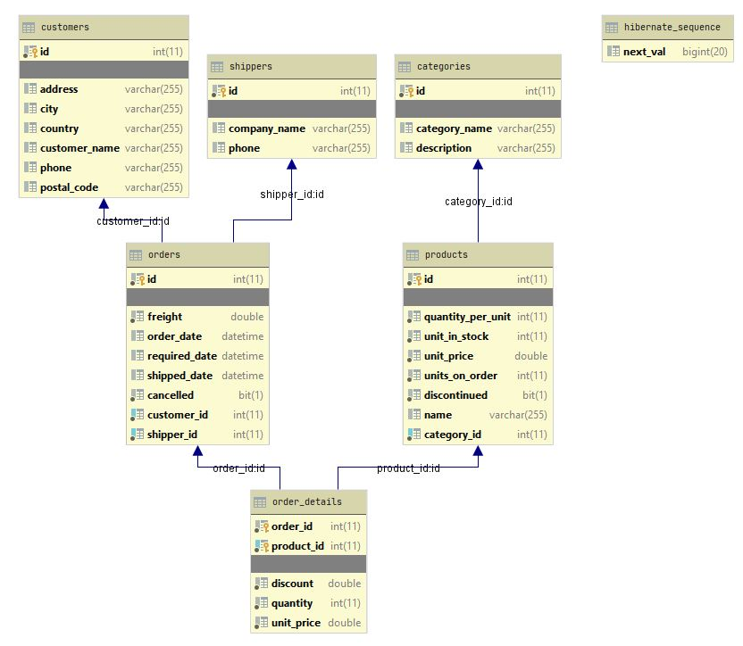

# DB-Project-2020
An implementation of a fragment of the Northwind database, covering products and their categories, suppliers,
customers and orders. Done entirely with Spring, using Hibernate and a MySql database.
### Contributors:
* Jerzy Jędrzejaszek
* Izabela Czajowska

**Database Schema**  
The database schema, generated automatically by DataGrip.

Access to Database
-----------
Database connection attributes are defined in /src/main/resources/application.properties. Please note that for the host's discretion the authentication credentials have been omitted. Go get your own :)

Structure
-----------
The code consists of a data model, Rest controller class, a data service, a database access class and an interface for it.

All of these are found in src/main/com/example/northwind:
* the data model is found in /model and contains all the entity classes, as well as some helper classes needed along the way
* the controller sits in /api
* the data service is in /service
* the database access class and its interface are both in /dao.

## The model
Nothing fancy, just a limited implementation of Northwind's structure. Of the interesting stuff, there's an OrderWrapper class
which enables us to send an entire order in a single request, which helps avoid errors. Also, the ID of OrderDetails is a custom
compound ID.

## The API  
The layer of user access. This receives requests, which are mapped to handler functions. For testing purposes, we suggest Postman. A premade set of queries can be found here:  
https://www.postman.com/collections/4c02334788c5f85de550?fbclid=IwAR0A6KJ_4wYTKsZZf-3-AdB_-5Cq3vJdpuSL4G9YC-44UkLxmdR0BdYgEzg  
  
To run down the requests real quick:

* **categories** are queried via a GET to /api/category and added via a POST to the same address. The POST's body contains a "name" and a "desc"ription. Categories are deleted via a DELETE to /api/categories/{category_id}

* **products** are queried in bulk via a GET to /api/product and in singular via a GET to /api/product/{product_id}. Products are added via a POST to /api/product/{category_id}, with the POST's body containing a "name", the "quantityPerUnit", a "unitPrice", "unitsInStock" and "unitsOnOrder". Products are deleted via a DELETE to /api/product/{product_id}

* **shippers** are queried via a GET to /api/shipper and added via a POST to the same address. The POST's body contains a "name" and a "phone" number

* **customers** are queried via a GET to /api/customer and added via a POST to the same address. The POST's body contains a "name", "address" consisting of street and house number, "city", "postalCode", "country" and "phone" number

* **orders** are queried via a GET to /api/order and added via a POST to the same address. This is the tricky one. The POST's body contains an "orderDate" and "requiredDate", the "freight", the "customer"'s ID and the "shipper"'s ID. It also contains "products", a list of product ID's, as well as "details", a list of objects containing the "quantity" and "discount" for a product. The entries at the same index of "products" and "details" correspond to each other, together describing the purchase of a single product within an order. Orders can be deleted via a POST to /api/order/{order_id}/cancel. This POST's body is irrelevant

* **order details** for a given order are queried via a GET to /api/orderDetails/{order_id}. Order details can be added to a specified order via a POST to /api/orderDetails/{order_id}/{product_id}, with the POST's body containing the "unitPrice", "quantity" and "discount" for the product

## The Service  
The data service acts as an intermediary between the API and the DAO, its sole purpose being to allow us to easily switch between
data access object implementations, in case we want to change the DB we're using. Here it's mostly useless since there's one DAO
implementation, but its good to have to keep the code easily expandible.

## The DAO  
The interface defines a set of methods needed to operate on the database, These methods are then implemented in an implementable
class. This class is where the real magic happens, this is where we actually work upon the database.

